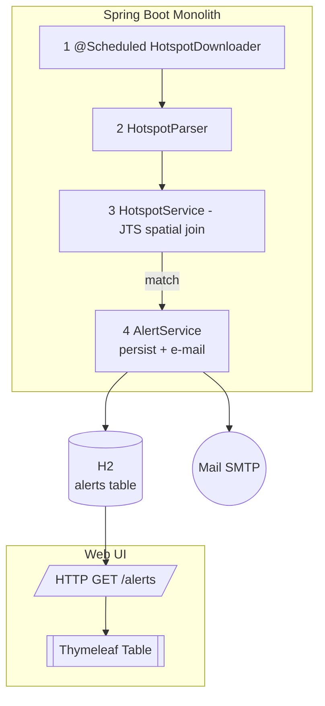
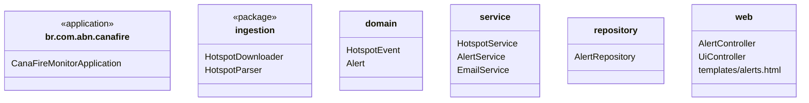

# Cana Fire Monitor — Beginner Edition

*A three-week Java 17 / Spring Boot project that ingests INPE hotspot CSVs, detects fires on sugar‑cane farms, stores alerts, and notifies the mill manager by e‑mail.*

---

## Table of Contents

1. [Stack & Versions](#stack--versions)  
2. [High‑Level Architecture](#high-level-architecture)  
3. [Folder & Package Layout](#folder--package-layout)  
4. [Hotspot CSV Source](#hotspot-csv-source)  
5. [Quick Start](#quick-start)  
6. [Configuration](#configuration)  
7. [Key Components & Code Snippets](#key-components--code-snippets)  
    7.1 [Scheduler & Downloader](#71--scheduler--downloader)  
    7.2 [CSV Parser](#72--csv-parser)  
    7.3 [Spatial Join](#73--spatial-join)  
    7.4 [Persistence](#74--persistence)  
    7.5 [REST + Thymeleaf UI](#75--rest--thymeleaf-ui)  
    7.6 [E‑mail Notification](#76--e-mail-notification)  
8. [Building & Testing](#building--testing)  
9. [Continuous Integration](#continuous-integration)  
10. [Quality Gates](#quality-gates)  
11. [Deploying on a t3.micro EC2](#deploying-on-a-t3micro-ec2)  
12. [Road Map (Stretch Goals)](#road-map-stretch-goals)  
13. [License](#license)

---

## Stack & Versions

| Layer | Library / Service | 
|-------|-------------------|
| JVM & Framework | Java 17 (LTS) · Spring Boot **3.3.x** |
| CSV | OpenCSV **5.11** |
| Geometry | JTS Topology Suite **1.19.0** |
| Database | H2 Database **2.2.x** |
| Mail | Spring Boot `starter-mail` (JavaMailSender) |
| Build Tool | Maven **3.9+** (+ wrapper) |
| Source Control | GitHub (`main`, `develop`, `feature/*`) |
| CI | GitHub Actions (`ci.yml`) |

---

## High‑Level Architecture



---

## Folder & Package Layout



```text
cana-fire-monitor/
├─ .github/workflows/ci.yml
├─ src/main/java/br/com/app/canafire/…
│     ├─ ingestion/
│     ├─ domain/
│     ├─ service/
│     ├─ repository/
│     └─ web/
├─ src/main/resources/
│     ├─ geo/farm.geojson
│     └─ templates/alerts.html
├─ src/test/java/…
├─ run.sh
├─ pom.xml
└─ README.md  ← *this file*
```

---

## Hotspot CSV Source

### 4.1 Official open‑data portal

INPE’s **Programa Queimadas** publishes CSVs for fire‑hotspot detections at several intervals.  
Landing page:  

```
https://terrabrasilis.dpi.inpe.br/queimadas/portal/dados-abertos/
```

### 4.2 Base directory for 10‑minute data  

```
https://dataserver-coids.inpe.br/queimadas/queimadas/focos/csv/10min/
```

The directory is updated every ~10 minutes and lists files like:  

```
focos_10min_20250521_1630.csv
focos_10min_20250521_1640.csv
```

| Placeholder | Meaning |
|-------------|---------|
| `YYYYMMDD` | Date in Brasília Time (UTC‑03 / UTC‑04 DST) |
| `HHMM` | Hour & minute, rounded down to the previous 10 minutes |

### 4.3 Quick Bash fetch‑latest script

```bash
base='https://dataserver-coids.inpe.br/queimadas/queimadas/focos/csv/10min'
latest=$(curl -s "$base/"           | grep -oE 'focos_10min_[0-9_]+\.csv'           | sort | tail -1)
curl -O "$base/$latest"
```

### 4.4 Other intervals

| Interval | Directory |
|----------|-----------|
| Daily summaries | `…/focos/csv/diario/` |
| Monthly | `…/focos/csv/mensal/` |
| Annual | `…/focos/csv/anual/` |

### 4.5 Usage tips

* Poll every ≥10 minutes.  
* Step back to the previous slot on 404.  
* Cite *“Dados abertos, Programa Queimadas/INPE”* in public outputs.

---

## Quick Start

```bash
git clone https://github.com/your-org/cana-fire-monitor.git
cd cana-fire-monitor
./mvnw spring-boot:run   -Dspring-boot.run.arguments="--mail.user=$MAIL_USER --mail.password=$MAIL_PASS"
```

> **Prerequisites** Java 17 JDK, Maven Wrapper, Gmail (or other SMTP) with an app‑password.

---

## Configuration

```properties
# ===== Hotspot download =====
app.pull-interval=600000
app.inpe.base=https://dataserver-coids.inpe.br/queimadas/queimadas/focos/csv/10min

# ===== E-mail =====
spring.mail.host=smtp.gmail.com
spring.mail.port=587
spring.mail.username=${MAIL_USER}
spring.mail.password=${MAIL_PASSWORD}
spring.mail.properties.mail.smtp.starttls.enable=true

# ===== Database =====
spring.datasource.url=jdbc:h2:file:./data/canamonitor
spring.jpa.hibernate.ddl-auto=update
```

---

## Key Components & Code Snippets

### 7.1 Scheduler & Downloader © 1

```java
@Component
@RequiredArgsConstructor
public class HotspotDownloader {
    private final WebClient client;

    @Scheduled(fixedDelayString = "${app.pull-interval}")
    public void pullLatestCsv() {
        client.get()
              .uri("")
              .retrieve()
              .bodyToFlux(String.class)
              .flatMap(HotspotParser::parse)
              .subscribe(HotspotService::handle);
    }
}
```

### 7.2 CSV Parser © 2

```java
public class HotspotParser {
    private static final ColumnPositionMappingStrategy<HotspotEvent> strat =
        new ColumnPositionMappingStrategy<>();
    static {
        strat.setType(HotspotEvent.class);
        strat.setColumnMapping("satTs","lat","lon","confidence");
    }
    public static Flux<HotspotEvent> parse(String csv) {
        return Flux.using(
            () -> new CSVReader(new StringReader(csv)),
            r -> Flux.fromIterable(new CsvToBeanBuilder<HotspotEvent>(r)
                    .withMappingStrategy(strat)
                    .build().parse()),
            CSVReader::close);
    }
}
```

### 7.3 Spatial Join © 3

```java
@Service
public class HotspotService {
    private final List<PreparedGeometry> farms;
    private final AlertService alertService;

    public HotspotService(@Value("classpath:geo/farm.geojson") Resource r) throws IOException {
        GeometryJSON gjson = new GeometryJSON();
        try (Reader rd = new InputStreamReader(r.getInputStream())) {
            Geometry farm = gjson.read(rd);
            this.farms = List.of(new PreparedGeometryFactory().create(farm));
        }
    }
    public void handle(HotspotEvent e) {
        farms.stream()
             .filter(pg -> pg.contains(e.toPoint()))
             .findFirst()
             .ifPresent(pg -> alertService.createAlert(e));
    }
}
```

### 7.4 Persistence © 4

```java
@Entity @Table(name = "alerts")
@Data @NoArgsConstructor @AllArgsConstructor
public class Alert {
    @Id @GeneratedValue private UUID id;
    private double lat;
    private double lon;
    private LocalDateTime timestamp;
}

@Repository
public interface AlertRepository extends CrudRepository<Alert, UUID> {
    List<Alert> findTop100ByOrderByTimestampDesc();
}
```

### 7.5 REST + Thymeleaf UI

`AlertController.java`
```java
@RestController
@RequiredArgsConstructor
@RequestMapping("/alerts")
public class AlertController {
    private final AlertRepository repo;

    @GetMapping
    public List<Alert> latest() {
        return repo.findTop100ByOrderByTimestampDesc();
    }
}
```

`UiController.java`
```java
@Controller
@RequiredArgsConstructor
public class UiController {
    private final AlertRepository repo;

    @GetMapping("/")
    public String home(Model m) {
        m.addAttribute("alerts", repo.findTop100ByOrderByTimestampDesc());
        return "alerts";
    }
}
```

`templates/alerts.html` (very short-form)
```html
<table>
  <tr><th>Time</th><th>Lat</th><th>Lon</th><th>Map</th></tr>
  <tr th:each="a : ${alerts}">
    <td th:text="${#dates.format(a.timestamp,'dd/MM HH:mm')}"/>
    <td th:text="${a.lat}"/>
    <td th:text="${a.lon}"/>
    <td><a th:href="'https://maps.google.com/?q='+${a.lat}+','+${a.lon}">link</a></td>
  </tr>
</table>
```

### 7.6 E‑mail Notification

```java
@Service
@RequiredArgsConstructor
public class EmailService {
    private final JavaMailSender mail;
    public void notify(Alert a) {
        SimpleMailMessage msg = new SimpleMailMessage();
        msg.setTo("manager@mill.com");
        msg.setSubject("🔥 Sugar‑cane fire detected");
        msg.setText(String.format(
            "Hotspot at %.4f, %.4f on %s%nMap: https://maps.google.com/?q=%f,%f",
            a.getLat(), a.getLon(), a.getTimestamp(), a.getLat(), a.getLon()));
        mail.send(msg);
    }
}
```

`AlertService` calls `emailService.notify(alert)` after saving.

---

## Building & Testing

```bash
./mvnw clean verify   # runs JUnit + JaCoCo coverage
```

Key unit tests live under `src/test/java/ingestion` and `src/test/java/service`.

---

## Continuous Integration

```yaml
name: Maven CI
on:
  push: { branches: [ main, develop ] }
  pull_request: { branches: [ main ] }

jobs:
  build:
    runs-on: ubuntu-latest
    steps:
      - uses: actions/checkout@v4
      - uses: actions/setup-java@v4
        with:
          distribution: temurin
          java-version: 17
          cache: maven
      - name: Test & Package
        run: mvn -B clean verify
```

---

## Quality Gates

| Tool | Rule |
|------|------|
| **JaCoCo** | ≥ 70 % line coverage |
| **Checkstyle** | Sun checks; build fails on severity > warning |
| **Dependabot** | Monthly security PRs |

---

## Deploying on a t3.micro EC2

```bash
sudo yum install java-17-amazon-corretto -y
scp target/canafiremonitor-*.jar ec2:/opt/canamonitor/
# create /etc/systemd/system/canamonitor.service (see docs)
sudo systemctl enable --now canamonitor
```

---

## Aditional Resources

- https://geojson.io/
- https://www.thymeleaf.org/
- https://www.h2database.com/

---

## License

Released under the **MIT License** — see `LICENSE`.

---

> *“Respect tradition; deliver quality first, then innovate.”*  
> *— Mentor’s motto*
